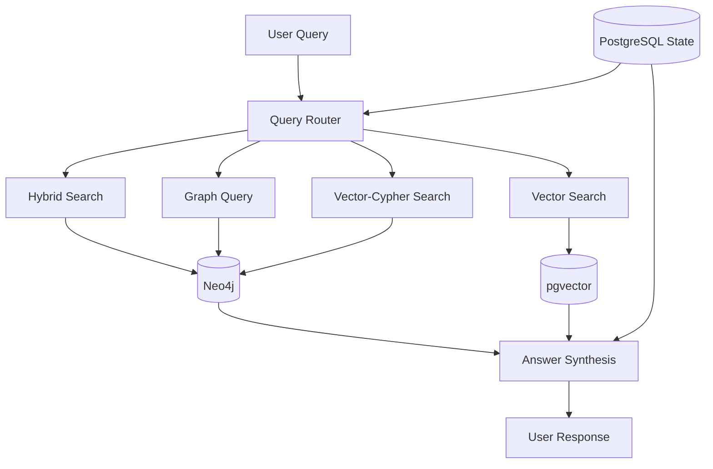

# Architecture Documentation

## System Overview

The LangGraph Agentic RAG system implements a production-grade retrieval-augmented generation architecture with the following key components:



## Core Components

### 1. Knowledge Backbone

#### Dual-Memory Architecture
- **Associative Memory (pgvector)**: Stores document chunks with embeddings for semantic search
- **Declarative Memory (Neo4j)**: Stores entities and relationships for graph traversal

#### Data Model
```cypher
// Neo4j Schema
(:Document {path, title})
(:Chunk {content, index, embedding})
(:__Entity__ {name, ...properties})

// Relationships
(Document)-[:HAS_CHUNK]->(Chunk)
(Chunk)-[:MENTIONS]->(Entity)
(Entity)-[:RELATES_TO]->(Entity)
```

### 2. Retrieval Strategies

#### Vector Retriever
- Pure semantic similarity search
- Uses cosine distance on embeddings
- Best for conceptual queries

#### Hybrid Retriever
- Combines vector search with full-text search
- Merges and re-ranks results
- Ideal for queries with specific terms

#### Graph Retriever
- Text2Cypher for natural language to graph queries
- Direct entity and relationship traversal
- Handles multi-hop relational queries

#### Vector-Cypher Retriever
- Two-phase retrieval: vector search then graph expansion
- Enriches context with related entities
- Provides comprehensive, structured results

### 3. Agent Control Flow

#### LangGraph StateGraph
```python
# Simplified flow
Start -> Router -> Retrieval -> Synthesis -> End
         |                |
         v                v
    Clarification    Error Handling
         |                |
         +----------------+
```

#### State Management
- Persistent state via PostgreSQL checkpointer
- Thread-based conversation continuity
- Automatic state snapshots after each node

#### Self-Correction
- Error detection and reflection
- Automatic retry with corrections
- Graceful degradation after max attempts

### 4. Production Features

#### Observability
- LangSmith integration for tracing
- Detailed logging at each step
- Performance metrics tracking

#### Human-in-the-Loop
- Approval workflows for critical actions
- Interrupt/resume capability
- Feedback incorporation

#### Scalability
- Async operations throughout
- Connection pooling for databases
- Stateless API design

## Data Flow

### Ingestion Pipeline
1. **Document Loading**: PDF/text files loaded and parsed
2. **Chunking**: Split into manageable segments (1000 chars)
3. **Embedding**: Generate vector embeddings for chunks
4. **Entity Extraction**: LLM extracts entities and relationships
5. **Storage**: 
   - Chunks + embeddings → pgvector
   - Entities + relationships → Neo4j

### Query Processing
1. **Query Analysis**: Router determines optimal strategy
2. **Retrieval**: Selected retriever fetches relevant context
3. **Synthesis**: LLM generates answer from context
4. **State Update**: Conversation state persisted
5. **Response**: Formatted answer returned to user

## Security Considerations

### API Security
- API key authentication
- CORS configuration
- Input validation and sanitization

### Data Security
- Environment variable management
- Secure database connections
- No hardcoded credentials

### Privacy
- Conversation isolation by thread
- User-specific state management
- Configurable data retention

## Performance Optimization

### Caching Strategy
- Embedding cache for repeated queries
- Query result caching (planned)
- Connection pooling for databases

### Indexing
- Vector indexes on embeddings
- Full-text indexes for keyword search
- Graph indexes on entity properties

### Resource Management
- Configurable chunk sizes
- Limited graph traversal depth
- Token usage optimization

## Extensibility

### Plugin Architecture
- Modular retriever design
- Tool-based agent capabilities
- Configurable routing logic

### Integration Points
- REST API for external systems
- Webhook support (planned)
- Event streaming (planned)

## Monitoring and Maintenance

### Health Checks
- Database connectivity
- API endpoint monitoring
- Resource usage tracking

### Maintenance Tasks
- Entity deduplication
- Index optimization
- State cleanup

### Backup and Recovery
- Database backup strategies
- State recovery mechanisms
- Disaster recovery procedures