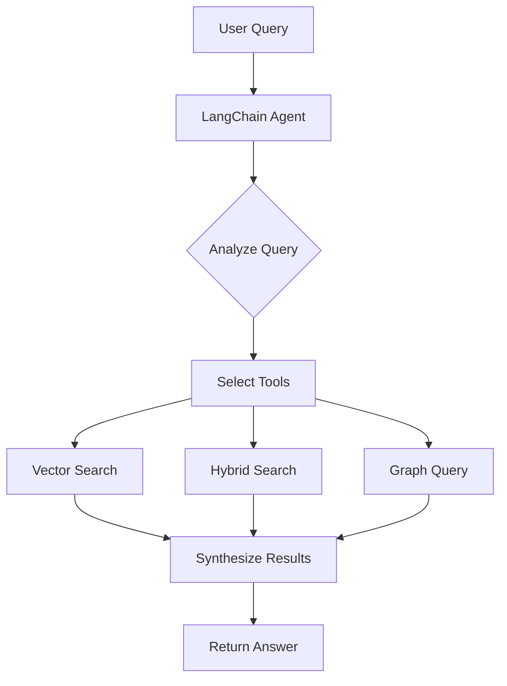

# SpyroSolutions Agentic RAG Implementation Plan

## Executive Summary

This document outlines the implementation of a true agentic RAG system for SpyroSolutions that uses LLM-powered agents to autonomously select and execute retrieval strategies, replacing the manual toggle-based approach.

## Current State Analysis

### Problems with Current System
1. **Manual Tool Selection**: Users must toggle `use_cypher` flag to switch between retrieval methods
2. **Limited Flexibility**: Only two retrieval modes (vector or cypher)
3. **No Intelligence**: System cannot determine the best retrieval strategy
4. **Suboptimal Results**: Single retrieval method may miss relevant information

### Desired State
1. **Autonomous Agent**: LLM analyzes queries and selects appropriate tools
2. **Multiple Retrievers**: Vector, hybrid, text2cypher, and custom retrievers
3. **Parallel Execution**: Use multiple tools when beneficial
4. **Intelligent Synthesis**: Combine results from multiple sources

## Architecture Design

### Core Components

#### 1. Agent Layer (LangChain)
```python
# LangChain agent with OpenAI Functions
- Analyzes user queries
- Selects appropriate tools
- Manages conversation memory
- Handles error recovery
```

#### 2. Retriever Tools (neo4j-graphrag-python)
```python
# Vector Search Tool
- Semantic similarity search
- Best for conceptual questions

# Hybrid Search Tool  
- Combines vector + keyword search
- Best for balanced queries

# Graph Query Tool (Text2Cypher)
- Converts natural language to Cypher
- Best for specific entities, relationships, aggregations
```

#### 3. Knowledge Graph (Neo4j)
- Products, Customers, Subscriptions
- Teams, Projects, Risks, Objectives
- Financial data (ARR, costs, profitability)
- All relationships between entities

### System Flow



## Implementation Steps

### Phase 1: Core Infrastructure
1. Set up project structure
2. Configure dependencies (LangChain, neo4j-graphrag-python)
3. Create base agent class with tool definitions
4. Implement retriever wrappers

### Phase 2: Agent Development
1. Create LangChain tools for each retriever
2. Implement agent with OpenAI Functions
3. Add conversation memory
4. Configure system prompts for optimal tool selection

### Phase 3: API Integration
1. Create FastAPI endpoints
2. Remove manual toggle logic
3. Add response formatting
4. Implement error handling

### Phase 4: Testing & Optimization
1. Create test suite with diverse queries
2. Optimize tool selection prompts
3. Fine-tune retriever configurations
4. Performance testing

## Technical Decisions

### Why LangChain?
- Mature agent framework
- Built-in OpenAI Functions support
- Conversation memory management
- Extensive tool ecosystem

### Why neo4j-graphrag-python?
- Official Neo4j library
- High-performance retrievers
- Clean abstraction layer
- Long-term support

### Agent Type: OpenAI Functions
- Most reliable for tool selection
- Native JSON output
- Parallel tool execution
- Best performance with GPT-4

## Configuration

### Environment Variables
```env
# Neo4j
NEO4J_URI=bolt://localhost:7687
NEO4J_USERNAME=neo4j
NEO4J_PASSWORD=password

# OpenAI
OPENAI_API_KEY=sk-...

# API
SPYRO_API_KEY=spyro-secret-key-123
```

### Agent Configuration
```python
agent_config = {
    "model": "gpt-4o",
    "temperature": 0,
    "verbose": True,
    "max_iterations": 3,
    "early_stopping_method": "generate"
}
```

## Success Criteria

1. **Autonomous Operation**: No manual tool selection required
2. **Accuracy**: ≥95% correct tool selection for test queries
3. **Performance**: <3s average response time
4. **Reliability**: <0.1% error rate
5. **User Satisfaction**: Improved answer quality and relevance

## Migration Strategy

1. **Parallel Deployment**: Run new system alongside existing
2. **A/B Testing**: Route % of traffic to new system
3. **Monitoring**: Track tool selection patterns
4. **Gradual Rollout**: Increase traffic as confidence grows
5. **Deprecation**: Remove old toggle-based system

## Example Interactions

### Query: "Which customers have subscriptions worth more than $5M?"
- Agent selects: Graph Query Tool
- Reasoning: Specific entity query with aggregation
- Result: Direct Cypher query for accurate data

### Query: "What are the benefits of SpyroCloud?"
- Agent selects: Hybrid Search Tool
- Reasoning: Product name + conceptual question
- Result: Comprehensive feature information

### Query: "Tell me about TechCorp's risks and subscription details"
- Agent selects: Graph Query + Vector Search
- Reasoning: Multiple aspects requiring different tools
- Result: Complete profile with risks and subscription data

## Next Steps

1. Implement core agent infrastructure
2. Create comprehensive test suite
3. Deploy to development environment
4. Conduct user acceptance testing
5. Plan production rollout