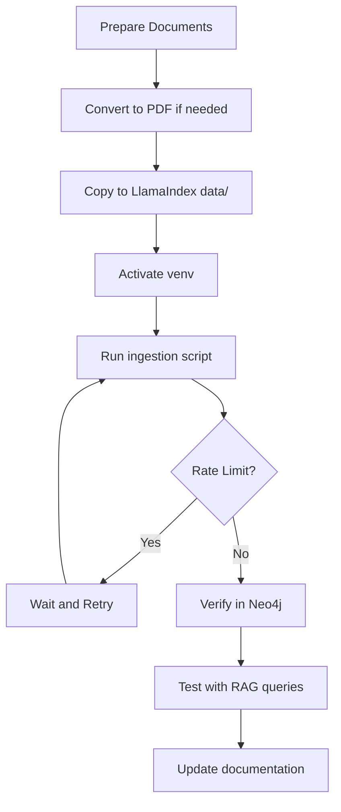

# SpyroSolutions Data Ingestion Guide

This guide provides detailed instructions for ingesting documents into the SpyroSolutions RAG system using the LlamaIndex knowledge graph pipeline.

## Table of Contents
1. [Overview](#overview)
2. [Prerequisites](#prerequisites)
3. [Ingestion Architecture](#ingestion-architecture)
4. [Step-by-Step Ingestion Process](#step-by-step-ingestion-process)
5. [Troubleshooting](#troubleshooting)
6. [Best Practices](#best-practices)
7. [API Rate Limits](#api-rate-limits)

## Overview

The SpyroSolutions RAG system uses a LlamaIndex-based knowledge graph for document ingestion. Documents are:
1. Parsed into structured content
2. Processed to extract entities and relationships
3. Stored in Neo4j with the LlamaIndex schema format (`:__Entity__:TYPE`)
4. Made available for RAG queries through the API

## Prerequisites

### Required Software
- Python 3.8+
- Neo4j 4.x or 5.x running on `bolt://localhost:7687`
- Active OpenAI API key with GPT-4 access
- LlamaIndex Cloud API key (for document parsing)

### Environment Setup
```bash
# Set required environment variables
export OPENAI_API_KEY="your-openai-api-key"
export LLAMA_CLOUD_API_KEY="your-llamaindex-cloud-key"
export NEO4J_URI="bolt://localhost:7687"
export NEO4J_USER="neo4j"
export NEO4J_PASSWORD="your-neo4j-password"
```

### Directory Structure
```
/Users/eugene/dev/apps/n8n_workflow_runner/
├── spyro-agentic-rag/          # Main RAG application
│   └── data/                   # Source documents
│       ├── pdfs/               # PDF reports to ingest
│       └── *.md                # Markdown source files
└── llamaindex-knowledge-graph/  # Ingestion pipeline
    ├── src/                    # Pipeline source code
    ├── data/                   # Working directory for ingestion
    └── venv/                   # Python virtual environment
```

## Ingestion Architecture

### Schema Definition
The ingestion uses a custom SpyroGraphSchema that defines:

**Entity Types:**
- Core: CUSTOMER, PRODUCT, TEAM, PROJECT, RISK, OBJECTIVE
- Financial: REVENUE, COST, PROFITABILITY, ARR, OPERATIONAL_COST
- Technical: FEATURE, SYSTEM, INFRASTRUCTURE, VULNERABILITY
- Temporal: EVENT, MILESTONE, QUARTER, DEADLINE

**Relationship Types:**
- Customer: SUBSCRIBES_TO, HAS_RISK, HAS_SUCCESS_SCORE, HAS_COMMITMENT
- Product: OFFERS_FEATURE, HAS_ROADMAP, GENERATES_REVENUE
- Team: SUPPORTS, RESPONSIBLE_FOR, DEVELOPS, LED_BY
- Financial: COSTS, PROFITS_FROM, INVESTS_IN

### LlamaIndex Schema Format
All entities follow the pattern: `:__Entity__:TYPE`
- Example: `:__Entity__:CUSTOMER` instead of `:Customer`
- This ensures compatibility with LlamaIndex's property graph index

## Step-by-Step Ingestion Process

### 1. Prepare Documents

#### For PDF Documents:
```bash
# Place PDFs in the spyro-agentic-rag data directory
cp your-report.pdf /Users/eugene/dev/apps/n8n_workflow_runner/spyro-agentic-rag/data/pdfs/
```

#### For Markdown Documents:
```bash
# Convert markdown to PDF first
cd /Users/eugene/dev/apps/n8n_workflow_runner/spyro-agentic-rag
source venv/bin/activate
python3 convert_reports_to_pdf.py
```

### 2. Navigate to LlamaIndex Pipeline
```bash
cd /Users/eugene/dev/apps/n8n_workflow_runner/llamaindex-knowledge-graph
source venv/bin/activate
```

### 3. Create Ingestion Script

Create a new ingestion script or use the existing one:

```python
#!/usr/bin/env python3
"""Ingest documents into LlamaIndex knowledge graph"""

import os
import sys
from pathlib import Path
import shutil

sys.path.append(str(Path(__file__).parent))

from src.pipeline import KnowledgeGraphPipeline
from src.config import Config, GraphSchema

# Define schema (see Architecture section for full schema)
class SpyroGraphSchema(GraphSchema):
    def __init__(self):
        self.entities = ["CUSTOMER", "PRODUCT", "TEAM", ...]
        self.relations = ["SUBSCRIBES_TO", "HAS_RISK", ...]
        self.validation_schema = {...}

def main():
    # Copy PDFs to local data directory
    source_dir = Path("/path/to/your/pdfs")
    target_dir = Path("data")
    
    # Copy files
    pdf_files = list(source_dir.glob("*.pdf"))
    for pdf in pdf_files:
        shutil.copy2(pdf, target_dir / pdf.name)
    
    # Initialize pipeline
    config = Config()
    schema = SpyroGraphSchema()
    pipeline = KnowledgeGraphPipeline(config=config, schema=schema)
    
    # Process documents
    results = pipeline.process_multiple_documents(
        file_paths=[str(f) for f in pdf_files],
        clear_existing=False  # Keep existing data
    )
    
    print(f"Processed {results['files_processed']} documents")
    print(f"Extracted {results['total_nodes']} nodes")

if __name__ == "__main__":
    main()
```

### 4. Run Ingestion
```bash
python3 ingest_gap_reports.py

# Or for custom ingestion:
python3 your_ingestion_script.py
```

### 5. Monitor Progress
The ingestion will show:
- Document parsing status
- Entity extraction progress
- Relationship discovery
- Final statistics

Example output:
```
Started parsing the file under job_id 2a683b0a-3dbf-4911-8f9d-96394ac766c1
INFO:src.extractor:Found 16 text nodes and 10 table nodes
Documents processed: 4
Total nodes extracted: 157
```

### 6. Verify Ingestion

#### Check Neo4j:
```cypher
// Count entities by type
MATCH (n:__Entity__)
RETURN labels(n)[1] as type, count(n) as count
ORDER BY count DESC

// Sample customers
MATCH (c:__Entity__:CUSTOMER)
RETURN c.name LIMIT 5
```

#### Test with RAG queries:
```bash
cd /Users/eugene/dev/apps/n8n_workflow_runner/spyro-agentic-rag
./scripts/test_llamaindex_queries.sh
```

## Troubleshooting

### Common Issues

#### 1. Rate Limit Errors
```
openai.RateLimitError: Error code: 429 - Rate limit reached for gpt-4o
```
**Solution:** Wait 1-2 minutes and retry. Consider using a script with retry logic:
```python
import time
from tenacity import retry, wait_exponential, stop_after_attempt

@retry(wait=wait_exponential(min=1, max=60), stop=stop_after_attempt(5))
def process_with_retry():
    # Your ingestion code here
    pass
```

#### 2. Module Not Found
```
ModuleNotFoundError: No module named 'src.pipeline'
```
**Solution:** Ensure you're in the correct directory and virtual environment:
```bash
cd /Users/eugene/dev/apps/n8n_workflow_runner/llamaindex-knowledge-graph
source venv/bin/activate
```

#### 3. Neo4j Connection Failed
```
neo4j.exceptions.ServiceUnavailable: Unable to connect to localhost:7687
```
**Solution:** Start Neo4j and verify credentials:
```bash
# Check if Neo4j is running
neo4j status

# Start Neo4j if needed
neo4j start
```

#### 4. Document Parsing Failures
- Ensure PDFs are not corrupted
- Check file permissions
- Verify LlamaIndex Cloud API key is valid

### Checking Logs
```bash
# View detailed logs
tail -f ingestion.log

# Check Neo4j logs
tail -f /var/log/neo4j/neo4j.log
```

## Best Practices

### 1. Document Preparation
- **Use consistent formatting** in source documents
- **Include clear headers** to help entity extraction
- **Use tables** for structured data (costs, metrics, etc.)
- **Avoid scanned PDFs** - use text-based PDFs

### 2. Batch Processing
- **Process similar documents together** for better context
- **Limit batch size** to 5-10 documents to avoid rate limits
- **Use incremental ingestion** (clear_existing=False)

### 3. Schema Management
- **Define entities clearly** before ingestion
- **Use consistent naming** across documents
- **Validate relationships** match your schema

### 4. Performance Optimization
```python
# Process documents in smaller chunks
batch_size = 5
for i in range(0, len(documents), batch_size):
    batch = documents[i:i+batch_size]
    pipeline.process_multiple_documents(batch)
    time.sleep(30)  # Avoid rate limits
```

### 5. Data Quality
- **Review extracted entities** after ingestion
- **Check for duplicates** in Neo4j
- **Validate relationships** make business sense

## API Rate Limits

### OpenAI Limits
- **GPT-4**: 10,000 tokens/min (varies by plan)
- **Embeddings**: 1,000,000 tokens/min

### Mitigation Strategies:
1. **Add delays between documents**
2. **Use retry logic with exponential backoff**
3. **Process during off-peak hours**
4. **Consider upgrading API plan**

### Rate Limit Handler Example:
```python
import time
from typing import List

def ingest_with_rate_limit_handling(documents: List[str], pipeline):
    """Ingest documents with rate limit handling"""
    
    for i, doc in enumerate(documents):
        try:
            print(f"Processing document {i+1}/{len(documents)}: {doc}")
            pipeline.process_single_document(doc)
            
            # Add delay to avoid rate limits
            if i < len(documents) - 1:
                time.sleep(10)  # 10 second delay between documents
                
        except Exception as e:
            if "rate_limit" in str(e).lower():
                print(f"Rate limit hit, waiting 60 seconds...")
                time.sleep(60)
                # Retry the document
                pipeline.process_single_document(doc)
            else:
                raise e
```

## Ingestion Workflow Summary



## Quick Reference Commands

```bash
# Full ingestion workflow
cd /Users/eugene/dev/apps/n8n_workflow_runner/llamaindex-knowledge-graph
source venv/bin/activate
python3 ingest_gap_reports.py

# Check ingestion results
neo4j-admin database info neo4j

# Test the RAG system
cd /Users/eugene/dev/apps/n8n_workflow_runner/spyro-agentic-rag
./scripts/test_all_business_questions.sh

# Monitor Neo4j
cypher-shell -u neo4j -p password "MATCH (n) RETURN count(n)"
```

## Support

For issues or questions:
1. Check the troubleshooting section
2. Review logs in both project directories
3. Verify all environment variables are set
4. Ensure Neo4j is running and accessible

Remember: Patience with rate limits and careful document preparation are key to successful ingestion!